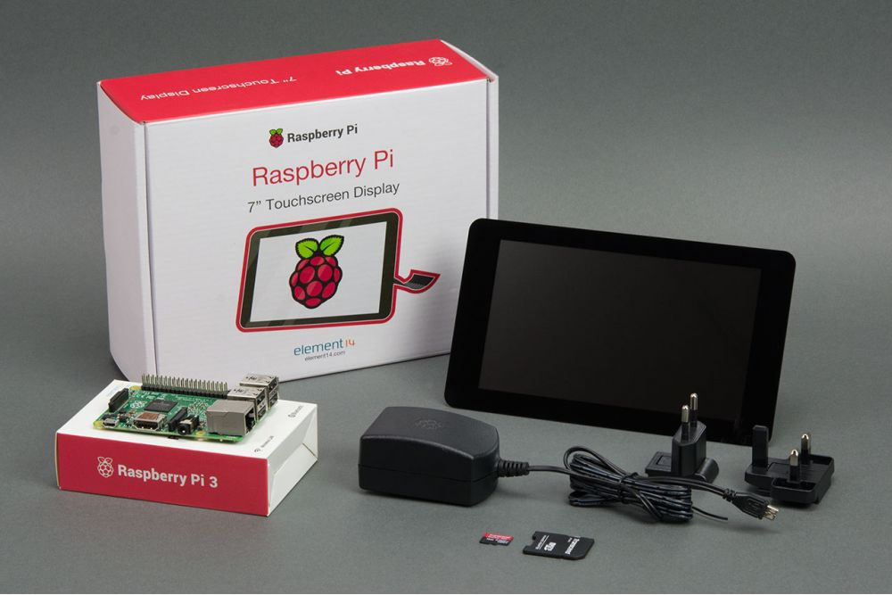
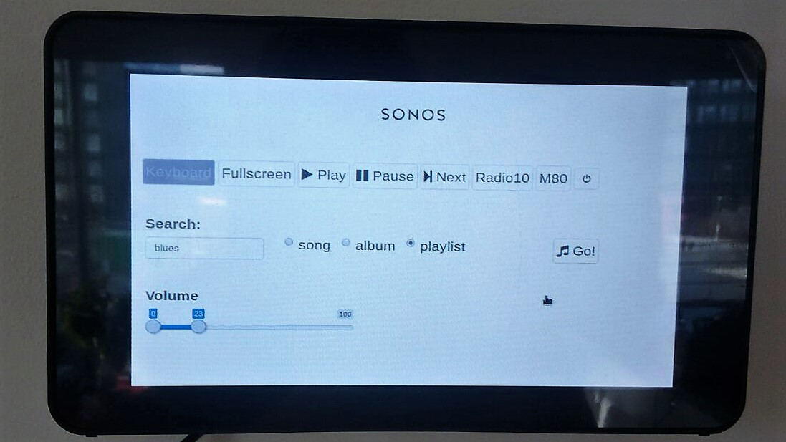

# touch-screen-pi-sonos-app
This repo explains how I made a simple R Shiny app that allows to basic functionalities to control the sonos from a raspberry Pi3 with touchscreen. This app is made with the [node-sonos-http-api](https://github.com/jishi/node-sonos-http-api) and a Raspberry Pi3 touchscreen kit that came with a sd card with raspbian pre-installed:



##Install an on screen virtual keyboard

If you look for a virtual keyboard for your raspberry Pi touchscreen, there are two that are often mentioned and used by pi users (a reboot might be required after installation):

**Matchbox**:

`sudo apt-get install matchbox-keyboard`

Now you can access the keyboard:

> Menu >> Accessories >> Keyboard

**Florence**:

`sudo apt-get install florence`

Now you can access the florence keyboard:

> Menu >> Universal Access >> Florence Virtual Keyboard

In case you have installed Florence and you notice the keyboard is giving errors (closing after pressing a key), it can be fixed with:

`sudo apt-get install at-spi2-core`

I have tried both keyboards, and I personally prefer the Florence keyboard since it overlays for example the browser pages, whereas on my pi the matchbox keyboard resizes the pages to half of the (already quite tiny) screen.

##Install Node.js and npm

For some reason the pre-installed raspian on my pi3 came without npm (Node Package Manager) installed, so first of all, I needed to install Node.js and npm (v6). These instructions are based on the official Node.js documentation, that can be found [here](https://nodejs.org/en/download/package-manager/#debian-and-ubuntu-based-linux-distributions).

On the terminal login and run the following command to download the package:
`$ curl -sL https://deb.nodesource.com/setup_6.x | sudo -E bash -`

Now, to proceed with the installation, simply run:
`$ sudo apt-get install -y nodejs`

Once ready, to make sure that Node.js has been properly installed, you can check the version with the command `node -v`. Same happens with npm; find out the current version running `npm -v`.

##Install the Sonos HTTP API

On the next steps we will be getting ready the excellent [Sonos HTTP API](https://github.com/jishi/node-sonos-http-api) from [Jimmy Shimizu](https://github.com/jishi).

On the home folder of your Orange Pi, clone the repository by running the following command:
`$ git clone https://github.com/jishi/node-sonos-http-api.git`

Now head to the folder with:
`$ cd node-sonos-http-api`

We will need to download and install the required dependencies. For that, simply run:
`$ npm install --production`

Now, start the server with the command:
`$ npm start`

Now, just leave the terminal running (i.e. **do not logout yet**), open a browser on your raspberry pi, and head to the following URLs to check if your Sonos speaker responds to the HTTP requests.

This one will send a request to your sonos to say something:
`http://localhost:5005/sayall/Hello, dinner is ready`

This one will turn the volume up to 75%:
`http://localhost:5005/volume/75`

##Play music from Spotify and TuneIn radio

**Spotify**

As explained Sonos HTTP API repo, to use Spotify, go to <https://developer.spotify.com/my-applications/#!/applications/create> and create a Spotify application to get your client keys. Create a settings.json file in the node-sonos-http-api folder and copy the Client ID and the Client Secret values in it:

_settings.json_

```json
{
    "spotify": {
    "clientId": "<YOUR SPOTIFY CLIENT ID>",
    "clientSecret": "<YOUR SPOTIFY CLIENT SECRET>"	
	}
}
```

 To see if your credentials work you can try the following URL:

`http://localhost:5005/musicsearch/spotify/playlist/quentin+tarantino`

**TuneIn Radio**

TuneIn does not require any setup or credentials. At this moment, the app includes just two buttons to switch directly to the radio stations that I play the most (**Radio10** and **M80**). I did not integrate an option yet to search through radio stations. However, you can play any radio station that is on TuneIn if you know its station id. You can find tunein station ids via services like [radiotime](http://opml.radiotime.com/). If you visit this link you will find the information about the radio stations formatted like this:

```
<outline URL="http://opml.radiotime.com/Tune.ashx?id=s103851" text="The Bluegrass Mix" type="audio" guide_id="s103851" preset_id="s103851" now_playing_id="s103851" image="http://cdn-radiotime-logos.tunein.com/s103851q.png" item="station" formats="mp3" genre_id="g63" subtext="Into The Blue" reliability="10" bitrate="128" current_track="Into The Blue" show_id="p410211"/>
```

The following URL plays **The Bluegrass Mix**:

`http://localhost:5005/tunein/play/103851`

##Installing R & the R shiny package

Installing R on the raspberry Pi3 is incredebly easy:

`sudo apt-get install r-base`

Now when you run the following command in the terminal, R should open:

`$ R`

Inside R, you can install the shiny package with the following command:

`> install.packages("shiny")`

##Installing xdotools

My plan was to hang the pi & screen on the wall and have the app running in fullscreen, so I can use it as a controller for the sonos system. I wanted it to be possible to exit the fullscreen mode from the pi itself (in other words: to press F11 without having to attach an external keyboard). For this reason I installed xdotools, it is a very light weight program that allows to send function key commands through the terminal.

To install xdotools, run:

`$ sudo apt-get install xdotool`

##Run the R shiny sonosApp

The [app.R](app.R) script included in this repo, runs a R shiny app that contains some **basic buttons** (Fullscreen, Play, Pause, Next), buttons for my two **radio stations** (Radio10, M80), a **search bar** with which you can search for songs, albums and playlists and a slider for the **volume control**. Unfortunately, it is not possible yet to open the keyboard in fullscreen mode - so the fullscreen button should always be pressed before the keyboard button. To make the app functional again after typing, close the keyboard. The app.R script uses the Florence keyboard (if you want to use matchbox-keyboard instead, replace `system("florence")` with `system("matchbox-keyboard")` in the script).

To give a minimal example of how shiny interacts with the node-sonos-http-api, see the example_app.R script below. 

_example_app.R_

```R
library(shiny)

ui <- fluidPage(
	actionButton("play","Play", icon = icon("play")),
	actionButton("pause","Pause", icon = icon("pause")),
	div(sliderInput("volume","Volume",
                    min=0, max=100, value=c(0,20),
                    ticks = FALSE)
       )
	)

server <- function(input, output){
	observeEvent(input$play,  {
		system('curl "http://localhost:5005/play"')
	  })
	observeEvent(input$pause,  {
		system('curl "http://localhost:5005/pause"')
	  })
	observeEvent(input$volume, {
		vol = input$volume[2]
		req = paste0('curl "','http://localhost:5005/volume/',
			as.character(vol),'"')
		system(req)
	  })
	}

shinyApp(ui,server)
```

To run the an R shiny app on the pi, open the terminal and open R:

`$ R`

Load the shiny package:

`> library(shiny)`

You can run the app now, by using the runApp() function and linking to the directory where the app.R file is stored:

`$ runApp("/home/pi/<DIRECTORY>")`

If you want to make the app accessible for other computers, or use a fixed port, you can do:

`$ runApp("/home/pi/<DIRECTORY>" host="0.0.0.0", port=1234)`




### To Do

* Add in a true integrated virtual keyboard
* TuneIn radio integration; make it possible to look up stations
* Remove the first input from the volume slider (useless)